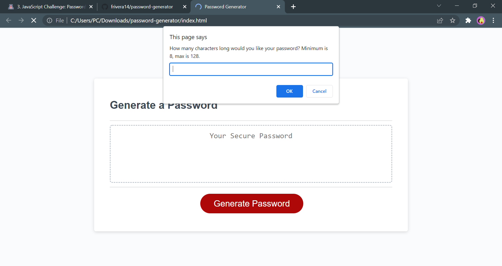

# Password Generator Starter Code
This is a password generator powered by javascript.

Through prompt confirmation, variables are given a true or false value.

Depending on the response of the prompt, the for loop will cycle through a switch case looking for selected attributes for the random password i.e. lower case, upper case, numbers, symbols, and specific length. 

https://frivera14.github.io/password-generator/

